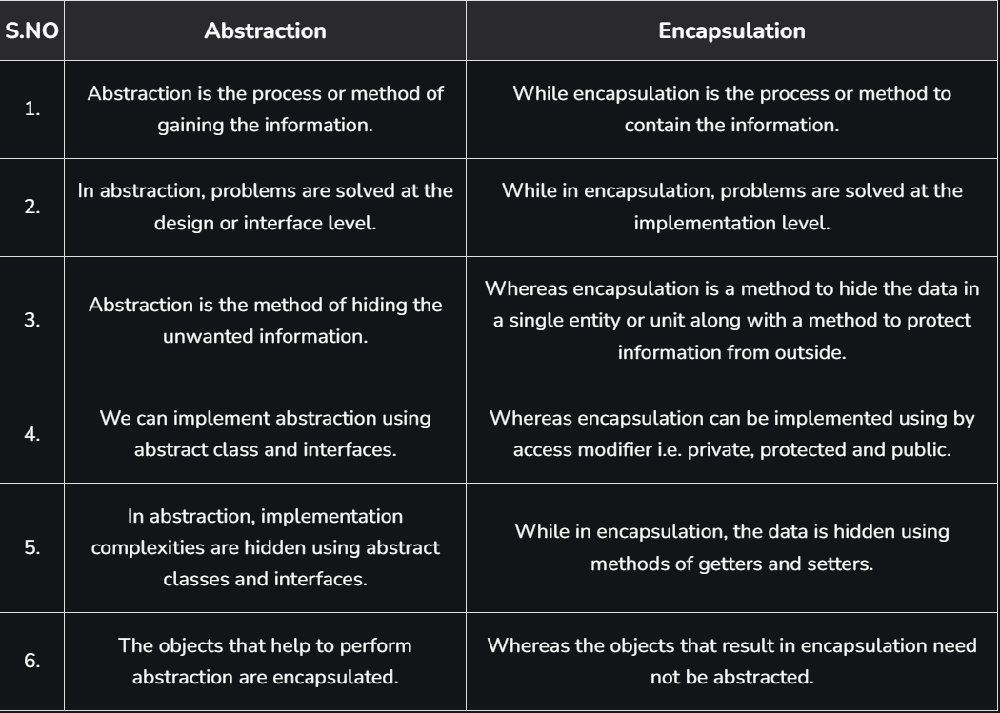
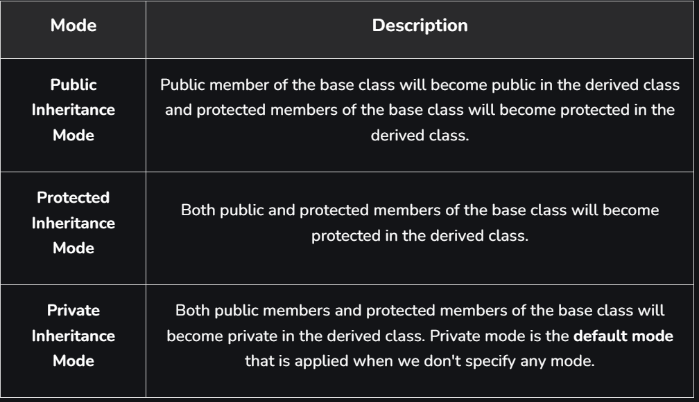
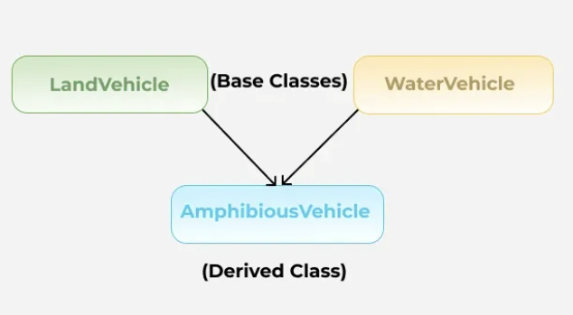
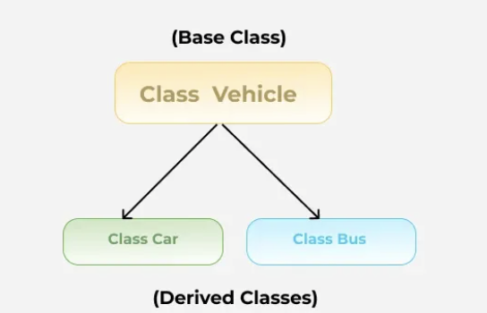
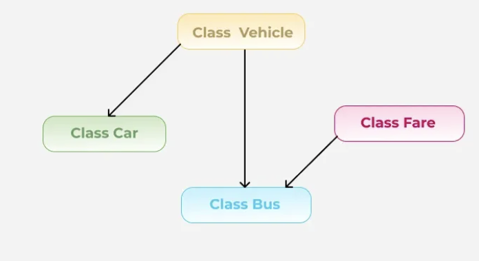

## Object-Oriented Programming (OOP) in C++ – Interview-Focused Notes

### 1. Introduction to OOP

OOP is a paradigm centered around the concept of objects, which encapsulate data and methods. It enhances modularity, reusability, and maintainability.

---

### 2. Key Components of OOP

- **Class**: Blueprint for creating objects.
- **Object**: Instance of a class.
- **Attributes**: Variables holding state.
- **Methods**: Functions representing behavior.
- **Encapsulation**: Wrapping data and methods.
- **Abstraction**: Hiding complex implementation.
- **Inheritance**: Acquiring features from a base class.
- **Polymorphism**: Different behaviors via the same interface.

---

### 3. Class & Object

```cpp
class Car {
public:
    string brand;
    int speed;
    void drive() {
        cout << brand << " is driving at " << speed;
    }
};

Car c1;
c1.brand = "BMW";
c1.speed = 100;
c1.drive();
```

---

### 4. Encapsulation

- Encapsulation is defined as the wrapping up of data and information in a single unit. In Object Oriented Programming, encapsulation is defined as binding together the data and the functions that manipulate them.

- Encapsulation facilitates data hiding in C++ by using private, protected and public access specifiers for restricting access to the class member functions and data members.

- Full Encapsulation refers to a design principle where all data members (variables) of a class are marked as private and can only be accessed or modified through public getter and setter functions.

```cpp
class Student {
private:
    int age;
public:
    void setAge(int a) { age = a; }
    int getAge() { return age; }
};
```


### Access Modifiers in C++

In C++, access modifiers or access specifiers in a class are used to assign the accessibility to the class members, i.e., they set some restrictions on the class members so that they can't be directly accessed by the outside functions. 

There are 3 types of access modifiers available in C++:

1. Public Specifier
All the class members declared under the public specifier will be available to everyone. The data members and member functions declared as public can be accessed by other classes and functions too. The public members of a class can be accessed from anywhere in the program using the direct member access operator (.) with the object of that class. 

- If we do not specify any access modifiers for the members inside the class, then by default the access modifier for the members will be Private.

2. Private Specifier
The class members declared as private can be accessed only by the member functions inside the class. They are not allowed to be accessed directly by any object or function outside the class. Only the member functions or the friend functions/ friend class are allowed to access the private data members of the class.

- How to Access Private Members?
The standard way to access the private data members of a class is by using the public member functions of the class. The function that provides the access is called getter method and the function that updates the value is called the setter method. 

Example: 
​
class Circle {  
private: 
    double radius;
    
public:
    double getRadius() {
        return radius;
    }
    void setRadius(double val) {
        radius = val;    
    }
    
    double  compute_area() {
        return 3.14*radius*radius;
    }
};

3. Protected Specifier
The protected access modifier is similar to the private access modifier in the sense that it can't be accessed outside of its class unless with the help of a friend class. The difference is that the class members declared as Protected can be accessed by any subclass (derived class) of that class as well. 

---

### 5. Abstraction

- Abstraction means displaying only essential information and ignoring the other details. 
- Data abstraction -> refers to providing only essential information about the data to the outside world, hiding the background details or implementation.
- Control Abstraction -> This type only shows the required information about the implementation and ignores unnecessary details.

- Abstraction using Access Specifiers-> the members that define the internal implementation can be marked as private in a class. And the important information needed to be given to the outside world can be marked as public. And these public members can access the private members as they are inside the class.

```cpp
class Shape {
public:
    virtual void draw() = 0; // Pure virtual
};

class Circle : public Shape {
public:
    void draw() override {
        cout << "Drawing Circle";
    }
};
```


---

### 6. Inheritance

- The capability of a class to derive properties and characteristics from another class is called Inheritance.
- Syntax->
class DerivedClass : mode_of_inheritance BaseClass {
    // Body of the Derived Class
};

Example->

```cpp
class Animal {
public:
    void eat() { cout << "Eating"; }
};

class Dog : public Animal {
public:
    void bark() { cout << "Barking"; }
};
```

- 

- The private members in the base class cannot be directly accessed in the derived class, while protected and public members can be directly accessed. To access or update the private members of the base class in derived class, we have to use the corresponding getter and setter functions of the base class or declare the derived class as friend class.

#### Types of Inheritance:

- Single-> In single inheritance, a class is allowed to inherit from only one class. i.e. one base class is inherited by one derived class only.
- Multiple-> Multiple Inheritance is a feature of C++ where a class can inherit from more than one class. i.e one subclass is inherited from more than one base class.

- Multilevel-> a derived class is created from another derived class and that derived class can be derived from a base class or any other derived class. There can be any number of levels. 
- Hierarchical->more than one subclass is inherited from a single base class. i.e. more than one derived class is created from a single base class.

- Hybrid-> implemented by combining more than one type of inheritance. For example: Combining Hierarchical inheritance and Multiple Inheritance will create hybrid inheritance in C++.


---

### 7. Polymorphism
- The word polymorphism means having many forms. polymorphism concept can be applied to functions and operators.

- Compile-time Polymorphism-> Also known as early binding and static polymorphism, in compile-time polymorphism, the compiler determines how the function or operator will work depending on the context. This type of polymorphism is achieved by function overloading or operator overloading.
- Function overloading-> is a feature of object-oriented programming where two or more functions can have the same name but behave differently for different parameters.Functions can be overloaded either by changing the number of arguments or changing the type of arguments.
   - example-> class Geeks {
    public:
        void add(int a, int b) {
            cout << "Integer Sum = " << a + b
            << endl;
        }
        void add(double a, double b) {
            cout << "Float Sum = " << a + b
            << endl ;
        }
    };

    int main() {
        Geeks gfg;
        gfg.add(10, 2);
        gfg.add(5.3, 6.2);

- Operator Overloading-> provide the operators with a special meaning for particular data type.
    - example: operator overloading for + to subtract to integer->
    class MyInt {
        int value;

    public:
        MyInt(int v) : value(v) {}

        // Overloading + to do subtraction
        MyInt operator+(const MyInt& other) {
            return MyInt(this->value - other.value);
        }

        void print() const {
            cout << "Value: " << value << endl;
        }
    };

- Runtime Polymorphism-> Also known as late binding and dynamic polymorphism, the function call in runtime polymorphism is resolved at runtime. Runtime polymorphism is implemented using function overriding with virtual functions.

- Function Overriding-> occurs when a derived class defines one or more member functions of the base class. That base function is said to be overridden. The base class function must be declared as virtual function for runtime polymorphism to happen.


#### Compile-Time:

```cpp
class Print {
public:
    void show(int x) { cout << x; }
    void show(string s) { cout << s; }
};
```

#### Run-Time:

```cpp
class Animal {
public:
    virtual void sound() {
        cout << "Some sound";
    }
};

class Dog : public Animal {
public:
    void sound() override {
        cout << "Bark";
    }
};
```

---

### 8. Constructors & Destructors

```cpp
class A {
public:
    A() { cout << "Constructor"; }
    ~A() { cout << "Destructor"; }
};
```

- Default
- Parameterized
- Copy Constructor

---

### 9. Virtual Functions & vTable

```cpp
class Base {
public:
    virtual void show() { cout << "Base"; }
    virtual ~Base() { cout << "Base destructor"; }
};
```

- Enables dynamic dispatch
- Virtual destructor ensures proper cleanup

---

### 10. Friend Function

```cpp
class A {
    int x = 10;
    friend void show(A);
};

void show(A a) {
    cout << a.x;
}
```

---

### 11. Operator Overloading

```cpp
class Complex {
public:
    int r, i;
    Complex operator+(Complex c) {
        Complex temp;
        temp.r = r + c.r;
        temp.i = i + c.i;
        return temp;
    }
};
```

---

### 12. Static Keyword

```cpp
class Test {
public:
    static int count;
    static void show() {
        cout << count;
    }
};
int Test::count = 0;
```

---

### 13. This Pointer

```cpp
class A {
    int x;
public:
    void setX(int x) { this->x = x; }
};
```

---

### 14. Deep vs Shallow Copy

```cpp
class Sample {
    int* data;
public:
    Sample(const Sample& s) {
        data = new int;
        *data = *(s.data); // Deep Copy
    }
};
```

---

### 15. Diamond Problem

```cpp
class A {};
class B : virtual public A {};
class C : virtual public A {};
class D : public B, public C {};
```

- Use virtual inheritance to avoid ambiguity

---

### 16. Common Interview Questions

- Class vs Struct
- Constructor vs Destructor
- Copy Constructor
- Virtual vs Pure Virtual
- Object Slicing
- Why Virtual Destructor?
- Overloading vs Overriding

---

### 17. Cheatsheet

| Concept              | Feature                      |
| -------------------- | ---------------------------- |
| Encapsulation        | Data hiding using class      |
| Abstraction          | Interface/pure virtual funcs |
| Inheritance          | Reusability of code          |
| Polymorphism         | Compile/run time behavior    |
| Static               | Shared across all instances  |
| Friend               | Access to private members    |
| Operator Overloading | Customize operators          |

